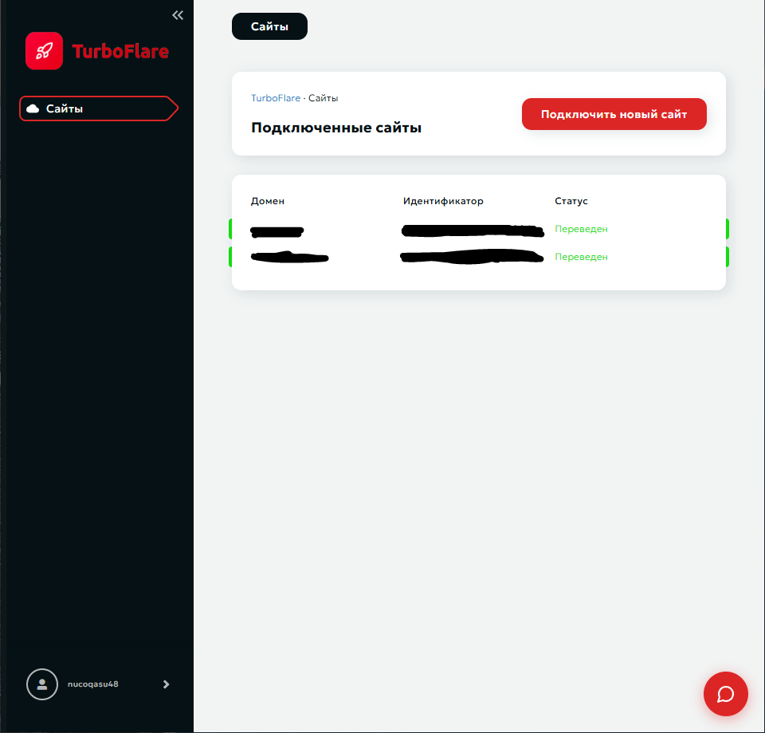
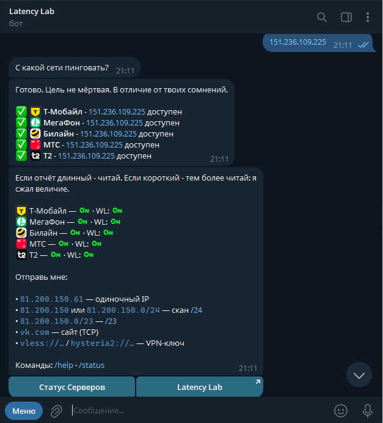
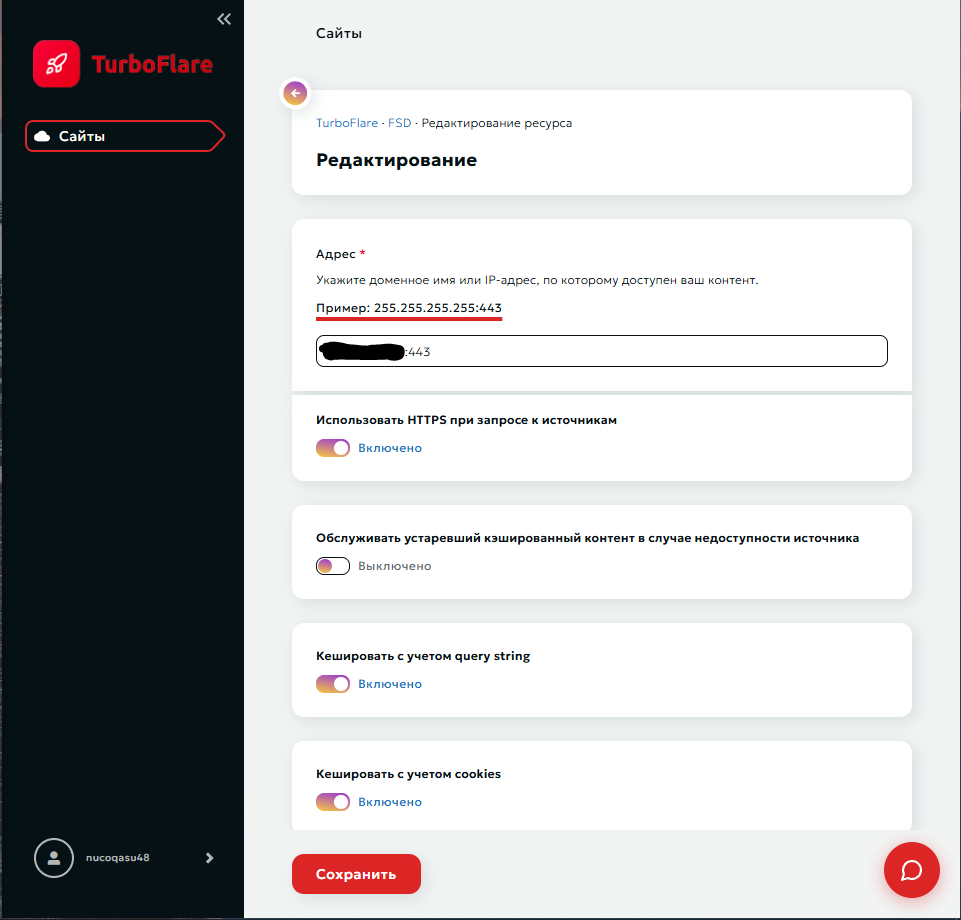

# Перенос домена на CDN Turboflare

Эта инструкция описывает только подключение собственного домена к CDN Turboflare и переключение его трафика через CDN.

## Что понадобится

Перед началом подготовьте:

| Что нужно | Описание |
|---|---|
| Домен | Нужен собственный домен. Подключение выполняется на уровне домена, а не отдельного поддомена. |
| Доступ к регистратору | Потребуется изменить NS-записи домена. |
| Адрес исходного сервера | Укажите IP-адрес сервера, на который CDN будет направлять запросы. |
| HTTPS-порт | Для этой схемы укажите порт `443`. |

## 1. Добавьте домен в Turboflare

1. Откройте панель Turboflare и войдите в аккаунт. Если аккаунта ещё нет, сначала зарегистрируйтесь и подтвердите контактные данные.
2. Нажмите **«Подключить сайт»**.
3. Введите имя домена.
4. Укажите IP-адрес исходного сервера и порт `443`.
5. Подтвердите добавление домена.



> Указывайте домен, который собираетесь делегировать через NS-записи. Одного добавления домена в панель недостаточно: сначала необходимо заменить NS-записи у регистратора.

## 2. Замените NS-записи у регистратора

После добавления домена Turboflare покажет два NS-сервера, назначенных для домена.

1. Скопируйте оба NS-сервера из панели Turboflare.
2. Откройте личный кабинет регистратора домена.
3. Найдите раздел **DNS**, **DNS-серверы** или **Делегирование домена**.
4. Замените текущие NS-серверы на те, которые указаны в Turboflare.
5. Сохраните изменения.

.PNG)

У разных регистраторов названия разделов отличаются. Менять нужно именно NS-серверы делегирования, а не отдельную A-запись в DNS-зоне, если панель Turboflare явно требует делегирование домена.

.PNG)

## 3. Дождитесь делегирования домена
После этого можно спокойно идти гулять на 24 часа, хоть и пишут они от 15 минут, у меня оба домена делегировались 23-24 часа.

После замены NS-записей дождитесь, пока изменения распространятся и Turboflare подтвердит делегирование. Время зависит от регистратора и DNS-кэшей, поэтому проверяйте статус в панели Turboflare, а не только локально на компьютере.

Когда домен будет подтверждён, откройте его настройки в Turboflare и включите опцию **«Перевод трафика»**. После этого запросы к домену начнут проходить через CDN.

## 4. Проверьте подключение

Откройте в Turboflare страницу домена и перейдите в настройки DNS-зоны. Проверьте, что домен присутствует в зоне и для него указан исходный IP-адрес сервера.



Затем проверьте домен с внешней сети. Если используется инструмент проверки DNS или сервис определения IP, результат должен соответствовать схеме CDN, а исходный IP должен оставаться указанным как адрес назначения в настройках Turboflare.

## 5. Проверьте основные настройки CDN

Откройте настройки подключённого домена и убедитесь, что для исходного сервера указан порт `443`.



Если после включения трафика сайт или сервис недоступен, проверьте в следующем порядке:

1. домен действительно делегирован на NS-серверы Turboflare;
2. в панели указан правильный IP исходного сервера;
3. указан порт `443`;
4. на исходном сервере разрешены входящие подключения от CDN;
5. сертификат и HTTPS-настройки исходного сервера работают корректно.

## Краткая схема

```text
Регистратор домена
        │
        │ NS-записи Turboflare
        ▼
CDN Turboflare ─────► IP исходного сервера:443
```
